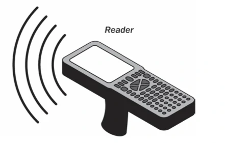
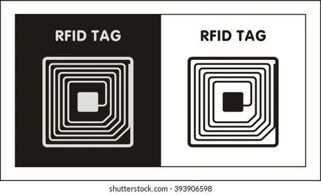
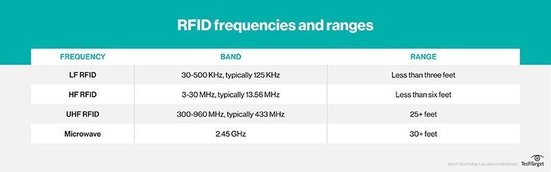
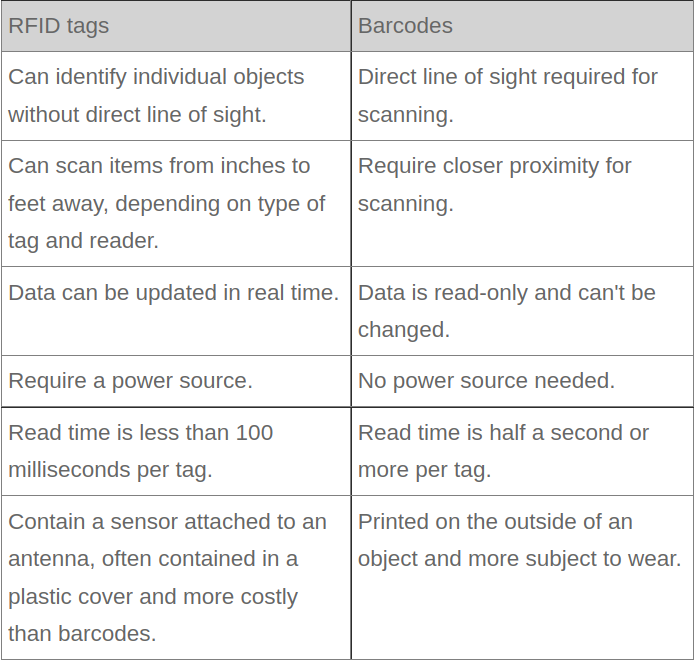

# RFID

Radio Frequency Identafication

Radio Frequency Identification (RFID) is the wireless non-contact use of radio frequency waves to transfer data. RFID systems usually comprise an RFID reader, RFID tags, and antennas.

RFID belongs to a group of technologies referred to as Automatic Identification and Data Capture (AIDC). AIDC methods automatically identify objects, collect data about them, and enter those data directly into computer systems with little or no human intervention. RFID methods utilize radio waves to accomplish this. At a simple level, RFID systems consist of three components: an RFID tag or smart label, an RFID reader, and an antenna. RFID tags contain an integrated circuit and an antenna, which are used to transmit data to the RFID reader (also called an interrogator). The reader then converts the radio waves to a more usable form of data. Information collected from the tags is then transferred through a communications interface to a host computer system, where the data can be stored in a database and analyzed at a later time.

* RFID Reader
  * An RFID reader is the brain of the RFID system and is necessary for any system to function. Readers, also called interrogators, are devices that transmit and receive radio waves in order to communicate with RFID tags. RFID readers are typically divided into two distinct types – Fixed RFID Readers and Mobile RFID Readers. Fixed readers stay in one location and are typically mounted on walls, on desks, into portals, or other stationary locations.

* RFID Tag
  * An RFID tag in its most simplistic form, is comprised of two parts – an antenna for transmitting and receiving signals, and an RFID chip (or integrated circuit, IC) which stores the tag’s ID and other information. RFID tags transmit data about an item through radio waves to the antenna/reader combination. RFID tags typically do not have a battery (unless specified as Active or BAP tags); instead, they receive energy from the radio waves generated by the reader. When the tag receives the transmission from the reader/antenna, the energy runs through the internal antenna to the tag’s chip. The energy activates the chip, which modulates the energy with the desired information, and then transmits a signal back toward the antenna/reader.

* How RFID Works?
  * Tagging items with RFID tags allows users to automatically and uniquely identify and track inventory and assets. RFID takes auto-ID technology to the next level by allowing tags to be read without line of sight and, depending on the type of RFID, having a read range between a few centimeters to over 20+ meters.

* Types of RFID Systems:
  * Within the Electromagnetic Spectrum, there are three primary frequency ranges used for RFID transmissions – **Low Frequency(LF)**, **High Frequency(HF)**, and **Ultra-High Frequency(UHF)**.

      * LF 
        * These range from 30 KHzto 500 KHz, though the typical frequency is 125 KHz. LF RFID has short transmission ranges, generally anywhere from a few inches to less than six feet.
        
      * HF
        * These range from 3 MHzto 30 MHz, with the typical HF frequency being 13.56 MHz. The standard range is anywhere from a few inches to several feet.
      * UHF
        * UHF RFID systems. These range from 300 MHz to 960 MHz, with the typical frequency of 433 MHz and can generally be read from 25-plus feet away.

      * **Microwave RFID systems**. These run at 2.45 Ghzand can be read from 30-plus feet away.

  The frequency used will depend on the RFID application, with actual obtained distances sometimes varying from what is expected. For example, when the U.S. State Department announced it would issue electronic passports enabled with an RFID chip, it said the chips would only be able to be read from approximately 4 inches away. However, the State Department soon received evidence that RFID readers could skim the information from the RFID tags from much farther than 4 inches -- sometimes upward of 33 feet away.

  

  * Types of RFID Tags
    * **Active RFID** : An active RFID tag has its own power source, often a battery.
    *  **Passive RFID** : A passive RFID tag receives its power from the reading antenna, whose electromagnetic wave induces a current in the RFID tag's antenna.
  
  Low-power, embedded non-volatile memory plays an important role in every RFID system. RFID tags typically hold less than 2,000 KB of data, including a unique identifier/serial number. Tags can be read-only or read-write, where data can be added by the reader or existing data overwritten.

  * RFID vs BARCODE:
    * 

  * Selecting an RFID Tag :
    * What type of surface will you be tagging? On metal, plastic, wood, etc.?
    * What read range do you desire?
    * Size limitations (i.e. the tag can be no larger than x by y by z inches)?
    * Any excessive environmental conditions to consider? Excessive heat, cold, moisture, impact, etc.?
    * 

  

